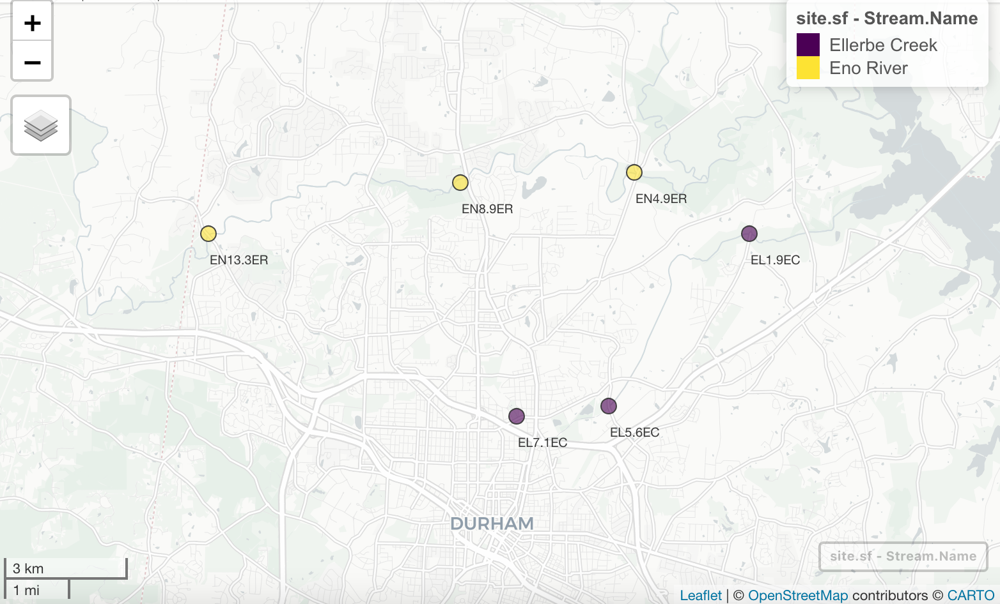

\newpage
\tableofcontents 
\newpage
\listoftables 
\newpage
\listoffigures 
\newpage

```{r setup, include=FALSE}
#Set your working directory
#Load your packages
library(tidyverse)
library(lubridate)
library(knitr)
library(mapview)
library(sf)

# Set your ggplot theme
theme <- 
  theme_bw() +
  theme(text = element_text(color = "black", size = 10),
        axis.text.x = element_text(color = "black"),
        axis.text.y = element_text(color = "black"))

theme_set(theme)

# Load your datasets
#Eno
Eno_River_parameters_clean <- read.csv("./Data/Processed/Eno_processed.csv")
Eno_River_parameters_stations <- read.csv("./Data/Processed/Eno_processed_wide.csv")

#Ellerbe
ellerbe.wide <- read.csv("./Data/Processed/Ellerbe_wide.csv")
ellerbe.grouped <- read.csv("./Data/Processed/Ellerbe_long.csv")

#site table
site.info <- read.csv("./Data/Raw/durham_station.csv")
```

# Rationale and Research Questions

Water quality of urban streams and rivers has been studied across the United States for the past several decades. These evaluations typically provide important insights about stressors on aquatic systems in urban environments, particularly natural pollutants such as nutrients, sediment, and heavy metals, as well as anthropogenic contaminants such as pesticides and other man-made chemicals. Many cities have programs dedicated to monitoring the health of local rivers and streams for the protection of humans and wildlife. 
  
Certain water quality parameters are commonly collected and used to assess health of urban streams. These include measurements of chemical, physical, and biological parameters that can be used independently or together to determine stream health. These parameters are often evaluated over time to highlight general trends in water quality in urban environments. In general, health of urban streams in the United States has been improving since the Clean Water Act was introduced in the 1970s.    
  
The main objective of our project was to understand current water quality trends in local urban streams between 2019 and 2020. Eno River and Ellerbe Creek in Durham, North Carolina were selected for evaluation in our study. These streams were chosen to provide a local context for evaluating recent changes in stream health. Additionally, the City of Durham collects monthly monitoring data for both Eno River and Ellerbe Creek for several metrics that they provide publicly, making this easily accessible data. This project includes an evaluation of the most common surface water quality parameters for which the City of Durham had data, including temperature, pH, dissolved oxygen, metals (zinc and copper), total phosphorus, fecal coliform, turbidity, and total suspended solids. All sites for each water body evaluated by the City of Durham were included. 
  
**Research Question:** 

1. What are the water quality trends between 2019 and 2020 for Ellerbe Creek and Eno River? 
    a. Has water quality changed between 2019 and 2020 for Ellerbe Creek and/or Eno River based on the various water quality parameters?
    b. Have certain water quality parameters changed while others have not?

# Dataset Information

The data was collected from the City of Durham's water quality data web portal. The portal includes data collected by the City's Stormwater Services as part of the Water Quality Monitoring and Assessment Program. The program performs ambient stream monitoring to assess compliance with regulatory benchmarks, assess surface water impairment, identify sources for illicit discharge, and support watershed planning.  The monitoring data includes information regarding the monitoring location, conditions, weather, and measurements. Nine parameters were chosen for analysis because of their monthly measurement frequency for 2019 and 2020 at the two streams of interest. The parameters of interest include Copper, Dissolved Oxygen, Fecal Coliform, pH, Total Phosphorus, Total Suspended Solids, Temperature, Turbidity, and Zinc. To extract relevant data from the portal the stream, water quality parameters, and dates of interest were selected for the user interface and downloaded to CSV files.

Once datasets for each of the parameters were downloaded, they were read into R and compiled into a single dataframe. First, a subset of the dataframe was created to keep only relevant columns for analysis. Next, the date column to read as a date to enable plotting and time series analysis. To address duplicate measurements, measurements for the same parameter, with the same date and monitoring location were averaged. Then, the parameters measurements were pivoted to include a column for each of the nine parameters.  To map the locations of each of the monitoring stations, the water quality dataframe was joined with station coordinates. 

Water Quality Parameters | Unit | Range | Data Source
-------------------------|------|-------|-------------
Copper| ug/L | 1.1-4.135 | Durham Water Quality Web Portal
Dissolved Oxygen | mg/L | 4.7-12.1 | Durham Water Quality Web Portal
Fecal Coliform | cfu/100mL | 17.5-36000 | Durham Water Quality Web Portal
pH | Standard Units | 6.1-7.5 | Durham Water Quality Web Portal
Total Phosphorus | mg/L | 0.003 - 0.38 | Durham Water Quality Web Portal
Total Suspended Solids| mg/L | 2.5-134 | Durham Water Quality Web Portal
Temperature| C | 5.7-29.6 | Durham Water Quality Web Portal
Turbidity| NTU | 2.3-150 | Durham Water Quality Web Portal
Zinc| ug/L | 0.975-19.2 | Durham Water Quality Web Portal
Rain in the last 24 Hours | NA | Yes/No | Durham Water Quality Web Portal
Sky Condition | NA | Sunny, Partly Cloudy, Overcast | Durham Water Quality Web Portal 

# Exploratory Analysis 
As part of the exploratory analysis, water quality data was compiled for the nine parameters for both the Eno River and Ellerbe Creek. The following sections describe the exploratory analysis completed for each waterway. 

Both Ellerbe Creek and Eno River have three monitoring stations in Durham. Sites EN13.3ER, EN8.9ER, and EN4.9ER for Eno River all had data for 2020, but only EN8.9ER had data for 2019. For Ellerbe Creek, sites EL1.9EC, EL5.6EC, and EL7.1EC had data for 2019, but only EL1.9EC and EL7.1EC had data for 2020. 

```{r, echo = FALSE, fig.align = 'center', out.width = "100%", fig.cap = "Site Map of Ellerbe Creek and Eno River Monitoring Stations"}

```

```{r, include = FALSE, message = FALSE}
getwd()
library(sf)
library(mapview)
library(leaflet)
library(leafem)

site.info <- read.csv("./Data/Raw/durham_station.csv")

```

## Eno River

The first part of the analysis included a comparative visualization of the nine water quality parameters for 2019 and 2020. In order to get a better understanding of conditions at each of the monitoring locations, sky condition was included in the exploratory analysis to determine if there was variation between sites. Additionally, the recorded sky condition was compared to measured temperature to determine if there was a relationship between cloud cover and temperature. The hypothesis was that temperature would be lower on cloudy days than sunny days. Temperature and sky condition relationships could indicate potential vegetation cover and shade at each of the monitoring locations. Based on the plots, there does not appear to be a relationship between sky conditions and temperature. In order to determine a relationship, daily or hourly sky condition nad temperature data may be required.  

```{r, echo=FALSE, fig.cap = "Relationship between temperature and sky condition on each sample day in Eno River for 2019 and 2020."}
ggplot(subset(Eno_River_parameters_clean, Parameter == "Temperature"), aes(x = Sky.Condition, y = Final_Value, fill = Station.Name)) +
  geom_boxplot() +
  scale_fill_viridis_d(begin = 0.7, end = 0.2, name = "Sampling Station") +
  labs(y = "Temperature (Celcius)", x = "Sky Condition") +
  theme+
  theme(panel.grid.major = element_blank())
```

Additionally, as part of the explanatory analysis the relationship between recent rainfall and turbidity was plotted. This relationship was analyzed to determine the impact of rainfall on erosion in the Eno River drainage area. Increased turbidity in the water following rain could be an indicator that soil and other particles are enter the river through erosion and surface runoff. The boxplot below shows relationship between rain and turbidity for 2019 and 2020. There is only turbidity data for one of the stations in 2019. However based on a visual comparison of the plots, there appears to be much higher concentrations of turbidity when is has rained in the last 24 hours. This relationship seems to be more exaggerated in the 2020 data.  

```{r, echo=FALSE, fig.cap = "Turbidity concentrations in Eno River for rain versus no rain in the last 24 hours for 2019 and 2020."}
ggplot(subset(Eno_River_parameters_clean, Parameter == "Turbidity"), aes(x = Rain.in.Last.24.Hours, y = Final_Value, fill = Station.Name)) +
  geom_boxplot() +
  geom_point(position = position_jitterdodge(jitter.width = 0.05), alpha = 0.7) +
  scale_fill_viridis_d(begin = 0.7, end = 0.2, name = "Sampling Station") +
  labs(y = "Turbidity (NTU)", x = "Rain in Last 24 Hours?") +
  theme+
  theme(panel.grid.major = element_blank())+
  facet_wrap(~Year, nrow=1, scales = "free") 
```

In addition to assessing conditions at each of the monitoring sites, the nine water quality parameters from 2019 and 2020 were visually compared. First, 2019 and 2020 monthly dissolved oxygen concentrations were plotted. Additionally, the North Carolina Water Quality Standard for dissolved oxygen is included on the plot. Dissolved oxygen has a lower limit standard of 4 ug/L. As shown below, concentrations of Dissolved Oxygen follow similar trend across stations and across years. The smoothed plot line shows that Dissolved Oxygen concentrations were overall slightly higher in 2019 than in 2020. However, none of the monthly dissolved oxygen concentrations fell below the lower limit of 4 ug/L. 

```{r, echo = FALSE, fig.cap = "Dissolved oxygen concentrations in 2019 and 2020 for Eno River.", message = FALSE, warning = FALSE}
ggplot(Eno_River_parameters_stations, aes(x = Month, y = Dissolved.Oxygen, color = Station.Name)) +
  geom_point() +
  geom_line() +
  geom_hline(yintercept = 4, lty = 2) +
  facet_wrap(~Year, nrow=2) +
  geom_smooth(method = "lm", se = FALSE) +
  scale_color_viridis_d(begin = 0.7, end = 0.2, name = "Sampling Station") +
  scale_x_continuous(breaks=seq(1,12,1)) +
  labs(y = "Dissolved Oxygen (mg/L)", x = "Month") +
  theme(axis.text.x = element_text(hjust = 1))+
  theme_bw()
```

Visual comparisons of pH from 2019 and 2020, showed similar values across stations and from 2019 to 2020. However, the maximum pH during the Summer peak is high in 2019, ~ 7.5, than in 2020, 7. Most of the pH data for both years shows that the pH in the Eno River is within in the range permissible by North Carolina Water Quality Parameters of 6-9. However, the December 2019 pH value is below the lower limit of 6.

```{r, echo = FALSE, message = FALSE, warning = FALSE, fig.cap= "pH in 2019 and 2020 for Eno River stations."}
ggplot(Eno_River_parameters_stations, aes(x = Month, y = pH, color = Station.Name)) +
  geom_point() +
  geom_line() +
  facet_wrap(~Year, nrow=2) +
  geom_smooth(method = "lm", se = FALSE) +
  geom_hline(yintercept = 6, lty = 2) +
  geom_hline(yintercept = 9, lty = 2, color = "red") +
  scale_color_viridis_d(begin = 0.7, end = 0.2, name = "Sampling Station") +
  scale_x_continuous(breaks=seq(1,12,1)) +
  labs(y = "pH", x = "Month") +
  theme_bw()
```

Based on the plots below, the Fecal Coliform has no discernible seasonal trend in both the 2019 and 2020 graphs. Most of the measurements for both years fall between 100 and 10,000. However, the maximum Fecal Coliform concentrations in 2020 are much higher than 2019. The maximum measured concentration in 2019 was approximately 5,000 and the maximum measured concentration in 2020 was around 35,000. Additionally, the North Carolina Water Quality Standard for fecal coliform is an upper limit of 400 cfu/100mL, the concentrations of fecal coliform exceeds this standard multiple time in 2019 and 2020.

```{r, echo = FALSE, message = FALSE, warning = FALSE, fig.cap= "Log-transformed fecal coliform in 2019 and 2020 for Eno River stations."}
ggplot(Eno_River_parameters_stations, aes(x = Month, y = Fecal.Coliform, color = Station.Name)) +
  geom_point() +
  geom_line() +
  geom_hline(yintercept = 400, lty = 2, color = "red") +
  scale_y_log10(
    breaks = scales::trans_breaks("log10", function(x) 10^x),
    labels = scales::trans_format("log10", scales::math_format(10^.x))) +
  annotation_logticks(sides = "l", scaled = TRUE) +
  scale_color_viridis_d(begin = 0.7, end = 0.2, name = "Sampling Station") +
  scale_x_continuous(breaks=seq(1,12,1)) +
  facet_wrap(~Year, nrow=2) +
  labs(y = "Fecal Coliform (cfu/100mL)", x = "Month") +
  theme 
```

The temperature data across stations and years shows a similar pattern of maximum temperatures occurring in the late summer months. There appears to be no significant difference in temperature between 2019 and 2020. Additionally, for both 2019 and 2020 the monthly temperatures are below the standard of 32 degrees Celcius.

```{r, echo = FALSE, message = FALSE, warning = FALSE, fig.cap= "Temperature in 2019 and 2020 for Eno River stations."}
ggplot(Eno_River_parameters_stations, aes(x = Month, y = Temperature, color = Station.Name)) +
  geom_point() +
  geom_line() +
  facet_wrap(~Year, nrow=2) +
  geom_hline(yintercept = 32, lty = 2, color = "red") +
  scale_color_viridis_d(begin = 0.7, end = 0.2, name = "Sampling Station") +
  scale_x_continuous(breaks=seq(1,12,1)) +
  labs(y = "Temperature (C)", x = "Month") +
  theme(axis.text.x = element_text(hjust = 1))+
  theme_bw()
```

Based on the plotted data, total phosphorus has no discernible pattern in the 2019 or 2020. Overall, concentrations seem relatively comparable besides a greater maximum measured value in the 2019 data.

```{r, echo = FALSE, message = FALSE, warning = FALSE, fig.cap= "Total phosphorus concentrations in 2019 and 2020 for Eno River stations."}
ggplot(Eno_River_parameters_stations, aes(x = Month, y = Total.Phosphorus, color = Station.Name)) +
  geom_point() +
  geom_line() +
  facet_wrap(~Year, nrow=2) +
  scale_color_viridis_d(begin = 0.7, end = 0.2, name = "Sampling Station") +
  scale_x_continuous(breaks=seq(1,12,1)) +
  labs(y = "Total Phosphorus (mg/L)", x = "Month") +
  theme(axis.text.x = element_text(hjust = 1))+
  theme_bw()
```

The plots of TSS show very different patterns across 2019 and 2020. There are peaks in concentration in the Spring of 2019 and the late Summer in 2020. Based on the plots, there appears to be greater TSS measured in 2020 than 2019.

```{r, echo = FALSE, message = FALSE, warning = FALSE, fig.cap= "Turbidity in 2019 and 2020 for Eno River stations."}
ggplot(Eno_River_parameters_stations, aes(x = Month, y = Total.Suspended.Solids, color = Station.Name)) +
  geom_point() +
  geom_line() +
  facet_wrap(~Year, nrow=2) +
  scale_color_viridis_d(begin = 0.7, end = 0.2, name = "Sampling Station") +
  scale_x_continuous(breaks=seq(1,12,1)) +
  labs(y = "Total Suspended Solids (mg/L)", x = "Month") +
  theme(axis.text.x = element_text(hjust = 1))+
  theme_bw()
```

The plots of turbidity show very different trends across 2019 and 2020. Similar to TSS, there is a peak in the Spring of 2019 and the late Summer of 2020. Based on the plots, the concentrations of Turbidity seem to be higher in 2020. Additionally, there is one month in 2019 with a Turbidity concentration above the North Carolina Water Quality Standard of 50 NTU. In 2020, there were 3 months with turbidity above the 50 NTU upper limit.

```{r, echo = FALSE, message = FALSE, warning = FALSE, fig.cap= "Turbidity in 2019 and 2020 for Eno River stations."}

ggplot(Eno_River_parameters_stations, aes(x = Month, y = Turbidity, color = Station.Name)) +
  geom_point() +
  geom_line() +
  facet_wrap(~Year, nrow=2) +
  geom_hline(yintercept = 50, lty = 2, color = "red") +
  scale_color_viridis_d(begin = 0.7, end = 0.2, name = "Sampling Station") +
  scale_x_continuous(breaks=seq(1,12,1)) +
  labs(y = "Turbidity (NTU)", x = "Month") +
  theme(axis.text.x = element_text(hjust = 1))+
  theme_bw()
```

Comparing the concentrations of Copper The Zinc concentrations are much higher in 2019 than in 2020. This is expected based on the North Carolina Water Quality Standards for each pollutant. Copper has an upper concentration limit of 7 ug/L and Zinc has an upper limit of 50 ug/L. Based on the plots, the Copper concentrations in Eno River appear consistent between 2019 and 2020. However, the plot shows a significant decrease in Zinc concentrations between 2019 and 2020. None of the monthly concentrations of Copper or Zinc exceed the North Carolina Water Quality Standards. 

```{r, echo = FALSE, message = FALSE, warning = FALSE, fig.cap= "Zinc and coppper concentrations in 2019 and 2020 for Eno River stations."}

ggplot(subset(Eno_River_parameters_clean,Parameter %in% c("Zinc", "Copper")),aes(x = Month, y = Final_Value, color = Station.Name)) +
  geom_point() +
  geom_line() +
  facet_grid(Year~Parameter) +
  scale_color_viridis_d(begin = 0.7, end = 0.2, name = "Sampling Station") +
  scale_x_continuous(breaks=seq(1,12,1)) +
  labs(y = "Concentration (ug/L)", x = "Month") +
  theme_bw() +
  theme(axis.text.x = element_text(hjust = 1))
```
 
\newpage


## Ellerbe Creek

Visual explorations of the nine water quality parameters for Ellerbe Creek were conducted to determine how these parameters changed between 2019 and 2020. First, because we are not able to visit the sites, we wanted to determine what the main site characteristics may be. One main exploration was the relationship between temperature and cloud cover, hypothesizing that if temperature is fluctuating with changes in cloud cover (e.g., temperatures increase on sunny days), this could indicated minimal riparian vegetation. Minimal riparian vegetation has impacts on water quality such as increased sedimentation, temperature, and runoff contamination. At Ellerbe Creek, for all stations, it was observed that temperature does not appear to change directly in response to cloud cover (Figure 12). To make any definitive determinations about this relationship, we would need more finite data than just one sample day per month. 

```{r, echo=FALSE, fig.cap = "Relationship between temperature and sky condition on sample day in Ellerbe Creek for 2019 and 2020."}
ggplot(subset(ellerbe.grouped, Parameter == "Temperature"), aes(x = Sky.Condition, y = Final_Value, fill = Station.Name)) +
  geom_boxplot() +
  scale_fill_viridis_d(begin = 0.7, end = 0.2, name = "Sampling Station") +
  facet_wrap(~Year, nrow=1) +
  labs(y = "Temperature (Celcius)", x = "Sky Condition") +
  theme+
  theme(panel.grid.minor = element_blank(),
        panel.grid.major = element_blank())
```

\newpage

We were also interested in the relationship between turbidity and rain, as an indicator of erosion and to what degree the Ellerbe Creek sites may be influenced by storm events. Visual comparisons show that there appears to be an increase in turbidity after rain events, especially in 2020 (Figure 13). Figure 2 also reveals that there may be an increase in turbidity between 2019 and 2020. 

```{r echo=FALSE, fig.cap = "Turbidity concentrations in Ellerbe Creek for rain versus no rain in the last 24 hours for 2019 and 2020. Points represent samples within each group."}
ggplot(subset(ellerbe.grouped, Parameter == "Turbidity"), aes(x = Rain.in.Last.24.Hours, y = Final_Value, fill = Station.Name)) +
  geom_boxplot() +
  geom_point(position = position_jitterdodge(jitter.width = 0.05), alpha = 0.7) +
  scale_fill_viridis_d(begin = 0.7, end = 0.2, name = "Sampling Station") +
  facet_wrap(~Year, nrow=1, scales = "free") +
  labs(y = "Turbidity (NTU)", x = "Rain in Last 24 Hours?") +
  theme+
  theme(panel.grid.minor = element_blank(),
        panel.grid.major = element_blank())
```

After completing site explorations, we wanted to look specifically at water quality parameters between 2019 and 2020. 
For dissolved oxygen, there were no distinguishable trends over time and did not appear to be differences between the sample sites for Ellerbe Creek (Figure 14). 

```{r, echo = FALSE, message = FALSE, warning = FALSE, fig.cap= "Dissolved oxygen concentrations in 2019 and 2020 for Ellerbe Creek stations. Black dashed line represents the lower limit water quality standard for dissvoled oxygen."}
ggplot(ellerbe.wide, aes(x = Month, y = Dissolved.Oxygen, color = Station.Name)) +
  geom_point() +
  geom_line() +
  geom_smooth(method = "lm", se = FALSE) +
  geom_hline(yintercept = 4, lty = 2) +
  scale_color_viridis_d(begin = 0.7, end = 0.2, name = "Sampling Station") +
  scale_x_continuous(breaks=seq(1,12,1)) +
  labs(y = "Dissolved Oxygen (mg/L)", x = "Month") +
  facet_wrap(~Year, nrow=2) +
  theme 
```

There appeared to be downward trend in pH, particularly throughout the year for 2020 (Figure 15), which warranted further investigation of this parameter in the Analysis section.

```{r, echo = FALSE, message = FALSE, warning = FALSE, fig.cap= "pH in 2019 and 2020 for Ellerbe Creek stations. Black dashed line represents the lower limit and red dashed line represents the upper limit water quality standard for pH."}
ggplot(ellerbe.wide, aes(x = Month, y = pH, color = Station.Name)) +
  geom_point() +
  geom_line() +
  geom_smooth(method = "lm", se = FALSE) +
  geom_hline(yintercept = 6, lty = 2) +
  geom_hline(yintercept = 9, lty = 2, color = "red") +
  scale_color_viridis_d(begin = 0.7, end = 0.2, name = "Sampling Station") +
  scale_x_continuous(breaks=seq(1,12,1)) +
  facet_wrap(~Year, nrow=2) +
  labs(y = "pH", x = "Month") +
  theme
```

Fecal coliform was near the upper water quality limit for both years, with spikes at both stations in August of both years greatly exceeding the upper water quality limit of 400 cfu/100mL. There did not appear to be a difference between the two years (Figure 16). Although we cannot provide further analysis for the observed peaks, they could be indicative of specific inputs to the creek around the same time each year. 

```{r, echo = FALSE, message = FALSE, warning = FALSE, fig.cap= "Log-transformed fecal coliform in 2019 and 2020 for Ellerbe Creek stations. Red dashed line represents the upper limit water quality standard for fecal coliform."}
ggplot(ellerbe.wide, aes(x = Month, y = Fecal.Coliform, color = Station.Name)) +
  geom_point() +
  geom_line() +
  geom_hline(yintercept = 400, lty = 2, color = "red") +
  scale_y_log10(
    breaks = scales::trans_breaks("log10", function(x) 10^x),
    labels = scales::trans_format("log10", scales::math_format(10^.x))) +
  scale_color_viridis_d(begin = 0.7, end = 0.2, name = "Sampling Station") +
  scale_x_continuous(breaks=seq(1,12,1)) +
  facet_wrap(~Year, nrow=2) +
  labs(y = "Fecal Coliform (cfu/100mL)", x = "Month") +
  theme 
```

Temperature was sporadic, which was expected based on seasonal variations in ambient air temperature. Temperature fluctuations appeared similar between both years and did not exceed maximum temperature thresholds based on current water quality standards for streams of 32 degrees Celcius (Figure 17).

```{r, echo = FALSE, message = FALSE, warning = FALSE, fig.cap= "Temperature in 2019 and 2020 for Ellerbe Creek stations. Red dashed line represents the upper limit water quality standard for temperature."}
ggplot(ellerbe.wide, aes(x = Month, y = Temperature, color = Station.Name)) +
  geom_point() +
  geom_line() +
  geom_hline(yintercept = 32, lty = 2, color = "red") +
  scale_color_viridis_d(begin = 0.7, end = 0.2, name = "Sampling Station") +
  scale_x_continuous(breaks=seq(1,12,1)) +
  facet_wrap(~Year, nrow=2) +
  labs(y = "Temperature (Celcius)", x = "Month") +
  theme 

```  

Total phosphorus appeared to increase throughout the year for both 2019 and 2020, but there did not appear to be an overall change in total phosphorus between 2019 and 2020 (Figure 18). This is likely seasonal due to temperature fluctuations and changing inputs throughout the year, however there were not a sufficient number of data points to conduct seasonal analyses. 

```{r, echo = FALSE, message = FALSE, warning = FALSE, fig.cap= "Total phosphorus concentrations in 2019 and 2020 for Ellerbe Creek stations."}
ggplot(ellerbe.wide, aes(x = Month, y = Total.Phosphorus, color = Station.Name)) +
  geom_point() +
  geom_line() +
  scale_color_viridis_d(begin = 0.7, end = 0.2, name = "Sampling Station") +
  scale_x_continuous(breaks=seq(1,12,1)) +
  facet_wrap(~Year, nrow=2) +
  labs(y = "Total Phosphorus (mg/L)", x = "Month") +
  theme
```

Total suspended solids appeare to increase between 2019 and 2020, with drastic spikes in concentrations during the late summer/early fall in 2020 for both sites that were not observed in 2019, when only a small spike was observed (Figure 19). We were not able to provide further analysis for why this peak was observed, but it could be due to input changes around that time of year in 2020 compared to 2019.Further analysis was conducted on the differences in TSS between 2019 and 2020 and is explained in the Analysis section.

```{r, echo = FALSE, message = FALSE, warning = FALSE, fig.cap= "Total suspended solids concentrations in 2019 and 2020 for Ellerbe Creek stations."}
ggplot(ellerbe.wide, aes(x = Month, y = Total.Suspended.Solids, color = Station.Name)) +
  geom_point() +
  geom_line() +
  scale_color_viridis_d(begin = 0.7, end = 0.2, name = "Sampling Station") +
  scale_x_continuous(breaks=seq(1,12,1)) +
  facet_wrap(~Year, nrow=2) +
  labs(y = "Total Suspended Solids (mg/L)", x = "Month") +
  theme 
```

Turbidity showed the same relationship as TSS, with values in 2020 appearing higher than those in 2019 and drastic peaks observed in late summer/early fall. In 2019, values did not exceed the upper water quality limit for turbidity. In 2020, values did exceed the upper limit for site EL1.9EC in August and September and for site EL7.1EC in August (Figure 20).

```{r, echo = FALSE, message = FALSE, warning = FALSE, fig.cap= "Turbidity in 2019 and 2020 for Ellerbe Creek stations. Red dashed line represents the upper limit water quality standard for temperature."}
ggplot(ellerbe.wide, aes(x = Month, y = Turbidity, color = Station.Name)) +
  geom_point() +
  geom_line() +
  geom_hline(yintercept = 50, lty = 2, color = "red") +
  scale_color_viridis_d(begin = 0.7, end = 0.2, name = "Sampling Station") +
  scale_x_continuous(breaks=seq(1,12,1)) +
  facet_wrap(~Year, nrow=2) +
  labs(y = "Turbidity (NTU)", x = "Month") +
  theme 

```

Metal concentrations in Ellerbe Creek were below the water quality standard for zinc and around or above the water quality standard for copper. Zinc concentrations appeared to decrease while copper remained consistent between 2019 and 2020 (Figure 21).

```{r, echo = FALSE, message = FALSE, warning = FALSE, fig.cap= "Zinc and coppper concentrations in 2019 and 2020 for Ellerbe Creek stations. Orange dashed line is the acute water quality standard for copper and grey dashed line is the acute water quality standard for Zinc in freshwater in North Carolina."}
                         
ggplot(subset(ellerbe.grouped, Parameter %in% c("Zinc", "Copper")), aes(x = Month, y = Final_Value, color = Station.Name)) +
  geom_point() +
  geom_line()+
  #geom_smooth(method = "lm", se = FALSE) +
  #geom_hline(yintercept = 3.6, lty = 2, color = "orange") +
  #geom_hline(yintercept = 36, lty = 2, color = "grey") +
  scale_color_viridis_d(begin = 0.7, end = 0.2, name = "Sampling Station") +
  scale_x_continuous(breaks=seq(1,12,1)) +
  facet_grid(Year~Parameter) +
  labs(y = "Metal Concentration (ug/L)", x = "Month") +
  theme
```

\newpage

# Analysis
Based on the results of the exploratory analysis, certain parameters were selected for additional analysis. Trends observed through visual inspection of the exploratory analysis plots led to further analysis of select water quality parameters.

## pH
Exploratory analysis revealed that pH decreased slightly between 2019 and 2020 for both Ellerbe Creek and Eno River stations. An ANOVA was conducted to determine the difference in pH between 2019 and 2020 across all sites for each stream. 

For Eno River, we performed an ANOVA which concluded that the difference in pH from 2019 to 2020 is not statistically significant, (p-value = 0.54).

For Ellerbe Creek , pH was significantly lower in 2020 compared to 2019 (p-value < 0.01). However, mean pH for both years is within what is considered the "normal" pH for streams (6-9), as shown by the upper and lower limits in Figure 4. 

The downward trend in Ellerbe Creek is concerning as it may cause pH levels to dip below the lower limit in future years. 

## Zinc & Copper

To determine whether there is a statistically significant change in copper and zinc concentrations in the Eno River from 2019 to 2020. An ANOVA was performed for 2019 and 2020 copper and zinc data. Based on the p-value, the change in copper from 2019 to 2020 was found not to be statistically significant (p-value = 0.6). However, the difference in zinc concentrations from 2019 to 2020 was determined to be statistically significant with a p-value < 0.01, with zinc concentrations significantly lower in 2020.

An ANOVA conducted to determine the if concentrations differ for metals between 2019 and 2020 in Ellerbe Creek revealed that there were no statistical differences between 2019 and 2020 concentrations for mean zinc (p-value = 0.22) or copper (p-value = 0.15) concentrations across all sites combined. 


## Turbidity and Recent Rainfall

Further analysis shows that the difference in turbidity in the Eno River from rain within the last 24 hours was only statistically significant in 2020, with a p-value < 0.01. There are almost four times more observations in 2020 than 2019 which may have impacted the ANOVA results for 2019 since there were only 10 observations. Additionally, an ANOVA of the Turbidity across years, showed that the difference in values from 2019 to 2020 was not statistically significant (p-value = 0.57).

In Ellerbe Creek, turbidity was significantly higher after rain event in both 2019 and 2020 (p-values < 0.01), indicating that erosion and sedimentation could be an issue for Ellerbe Creek. Additionally, turbidity was significantly higher in 2020 compared to 2019 (p-value = 0.03). 

## Total Suspended Solids (TSS) and Turbidity

The relationship between turbidity and TSS was conducted as a follow-up analysis to determine if these measures are correlated. Typically, if these values are correlated it indicates that observed turbidity and TSS are the result of increased sediment and particulate matter, and not due to other factors such as pollutants like dyes that impact one of these measurements but not the other. 

Figure 22 shows that TSS and Turbidity are closely linked and follow the same trend across stations and across years in Eno River. These parameters have similar peaks (see Exploratory Analysis figures). There is some variation across stations, but the pattern remains the same across. The results of the linear regression show that the two are correlated (p-value < 0.01), and the R-squared value tells us that 97% of the variance in Total Suspended Solids can be explained by variance in Turbidity.

The relationship between TSS and turbidity for Ellerbe Creek is shown in Figure 23 and is similar to Eno River. Based on regression analysis, these two values were correlated across all Ellerbe Creek sites combined in 2019 (p-value < 0.01, R-squared = 0.76) and 2020 (p-value < 0.01, R-squared = 0.98), again, indicating sedimentation is an issue.

```{r, echo = FALSE, message = FALSE, warning = FALSE, fig.cap = "Relationship between turbidity and total suspended solids for all sites in Eno River in 2019 and 2020."}
ggplot(Eno_River_parameters_stations, aes(x = Turbidity, y = Total.Suspended.Solids, color = Station.Name)) +
  geom_point() +
  geom_smooth(method = "lm", se = FALSE) +
  scale_color_viridis_d(begin = 0.7, end = 0.2, name = "Sampling Station") +
  facet_wrap(~Year, nrow = 1, scales = "free") +
  labs(y = "Total Suspended Solids (mg/L)", x = "Turbidity (NTU)") +
  theme 
```

```{r, echo = FALSE, message = FALSE, warning = FALSE, fig.cap = "Relationship between turbidity and total suspended solids for all sites in Ellerbe Creek in 2019 and 2020."}

ggplot(ellerbe.wide, aes(x = Turbidity, y = Total.Suspended.Solids, color = Station.Name)) +
  geom_point() +
  geom_smooth(method = "lm", se = FALSE) +
  scale_color_viridis_d(begin = 0.7, end = 0.2, name = "Sampling Station") +
  facet_wrap(~Year, nrow = 1, scales = "free") +
  labs(y = "Total Suspended Solids (mg/L)", x = "Turbidity (NTU)") +
  theme 
```


\newpage

# Summary and Conclusions

To assess the overall water quality of each stream, the NCDEQ Water Quality Standards were referenced to identify exceedances in the monitoring data across 2019 and 2020. In Eno River, pH fell below the lower limit of 6 once in 2019. Additionally, fecal coliform concentration in Eno River spiked above the upper limit of 400 cfu/100mL for two months in 2019 and four months in 2020. Finally, the turbidity in Eno River surpassed the water quality upper limit of 50 NTU once in 2019 and three times in 2020. Despite these exceedances,in Eno River the nine water quality parameters assessed were within NCDEQ standards for majority of 2019 and 2020. This signifies that overall Eno River is a relatively healthy waterway that met a majority of the NCDEQ freshwater quality standards in 2019 and 2020.   

For exceedances in Ellerbe Creek, the dissolved oxygen concentration fell below the NCDEQ lower limit of 4 mg/L for one month in 2019. Additionally, the fecal coliform concentration in Ellerbe Creek exceeded the upper limit of 400 cfu/100mL eight times in 2019 and six times in 2020. Also, the concentration of turbidity in Ellerbe Creek exceeded the upper limit of 50 NTU, twice in 2020. Finally, the copper concentration in Ellerbe exceeded the NCDEQ water quality standard of 7 ug/L once in 2020. Overall, Ellerbe Creek met a majority of the NCDEQ water quality standards in 2019 and 2020 with the exception of fecal coliform which had greater than 50% exceedances. High bacteria in the water across both years signifies the need for source control measures to identify and abate bacteria pollution.  Based on the Ellerbe Creek Watershed Management Improvement Plan, the City of Durham plans to address the high bacteria in Ellerbe Creek through BMP implementation, stream restoration projects, and sanitary sewer rehabilitation and replacement.

We suspected that water quality may show improvements in 2020 compared to 2019, as some studies have shown that the COVID-19 pandemic has resulted in improved surface water quality globally. Water quality changes between 2019 and 2020 were variable for both Ellerbe Creek and Eno River, with some parameters improving, most remaining the same, and some getting worse. Zinc concentrations, for example, decreased in both streams, but only significantly in Eno River. Turbidity on the other hand increased in 2020 for both streams. Decrease in zinc concentrations could be attributed to less road traffic. Break pads and tires release metal particles, which are considered a major source of zinc in urban streams. For turbidity, this could indicate more erosion and sedimentation in 2020 compared to 2019. However, because rainfall and turbidity are correlated, it could simply indicate that rainfall was higher in 2020 compared to 2019, which we were not able to confirm. In general, it appears that water quality did not improve overall from 2019 to 2020 in Eno River or Ellerbe Creek. It is interesting to note that specific parameters did improve, such as zinc, likely as a result of changes in urban traffic due to the pandemic.   

Both streams met a majority of the NCDEQ water quality standards in 2019 and 2020. Eno River and Ellerbe Creek both had a number of exceedances, but the majority of data for most parameters were within the NCDEQ standards. However, fecal coliform concentration in Ellerbe Creek exceeded the NCDEQ standard of 400 cfu/100mL for majority of the months across 2019 and 2020. This signifies that Ellerbe Creek is an impaired waterway with excessively and repetitively high bacteria concentrations. Additionally, this trend was observed across both 2019 and 2020, which supports the need for watershed improvements to address bacteria sources in the Ellerbe Creek drainage area. 

\newpage

# References
City of Durham, Water Quality Data - Web Portal. (2021). http://www.durhamwaterquality.org/

City of Durham. (2010, May). Ellerbe Creek Watershed Improvement Plan. https://durhamnc.gov/954/Ellerbe-Creek-Watershed-Improvement-Plan