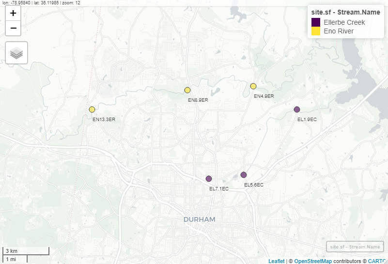

\newpage
\tableofcontents 
\newpage
\listoftables 
\newpage
\listoffigures 
\newpage

```{r setup, include=FALSE}
# Set your working directory
# Load your packages
library(tidyverse)
library(lubridate)
library(knitr)
library(mapview)
# Set your ggplot theme
theme <- 
  theme_bw() +
  theme(panel.grid.minor = element_blank(),
        panel.grid.major = element_blank(),
        text = element_text(color = "black", size = 10),
        axis.text.x = element_text(color = "black"),
        axis.text.y = element_text(color = "black"))

theme_set(theme)
# Load your datasets

#Ellerbe
ellerbe.wide <- read.csv("./Data/Processed/Ellerbe_wide.csv")
ellerbe.grouped <- read.csv("./Data/Processed/Ellerbe_long.csv")
```


# Rationale and Research Questions

Water quality of urban streams and rivers has been studied across the United States for the past several decades. These evaluations typically provide important insights about stressors on aquatic systems in urban environments, particularly natural pollutants such as nutrients, sediment, and heavy metals, as well as anthropogenic contaminants such as pesticides and other man-made chemicals. Many cities have programs dedicated to monitoring the health of local rivers and streams for the protection of humans and wildlife. 
  
Certain water quality parameters are commonly collected and used to assess health of urban streams. These include measurements of chemical, physical, and biological parameters that can be used independently or together to determine stream health. These parameters are often evaluated over time to highlight general trends in water quality in urban environments. In general, health of urban streams in the United States has been improving since the Clean Water Act was introduced in the 1970s.    
  
The main objective of our project was to understand current water quality trends in local urban streams between 2019 and 2020. Eno River and Ellerbe Creek in Durham, North Carolina were selected for evaluation in our study. These streams were chosen to provide a local context for evaluating recent changes in stream health. Additionally, the City of Durham collects monthly monitoring data for both Eno River and Ellerbe Creek for several metrics that they provide publicly, making this easily accessible data. This project includes an evaluation of the most common surface water quality parameters for which the City of Durham had data, including temperature, pH, dissolved oxygen, metals (zinc and copper), total phosphorus, fecal coliform, turbidity, and total suspended solids. All sites for each water body evaluated by the City of Durham were included. 
  
**Research Question:** 

1. What are the water quality trends between 2019 and 2020 for Ellerbe Creek and Eno River? 
    a. Has water quality changed between 2019 and 2020 for Ellerbe Creek and/or Eno River based on the various water quality parameters?
    b. Are there differences between sites for each stream?
    c. Have certain water quality parameters changed while others have not?
    d. Discussion point: Certain studies have shown that surface water quality improved in 2020 due to the pandemic. Do we observe the same trend?

\newpage

# Dataset Information

The data was collected from the City of Durham's water quality data web portal. The portal includes data collected by the City's Stormwater Services as part of the Water Quality Monitoring and Assessment Program. The program performs ambient stream monitoring to assess compliance with regulatory benchmarks, assess surface water impairment, identify sources for illicit discharge, and support watershed planning.  The monitoring data includes information regarding the monitoring location, conditions, weather, and measurements. Nine parameters were chosen for analysis because of their monthly measurement frequency for 2019 and 2020 at the two streams of interest. The parameters of interest include Copper, Dissolved Oxygen, Fecal Coliform, pH, Total Phosphorus, Total Suspended Solids, Temperature, Turbidity, and Zinc. To extract relevant data from the portal the stream, water quality parameters, and dates of interest were selected for the user interface and downloaded to CSV files.

Once datasets for each of the parameters were downloaded, they were read into R and compiled into a single dataframe. First, a subset of the dataframe was created to keep only relevant columns for analysis. Next, the date column to read as a date to enable plotting and time series analysis. To address duplicate measurements, measurements for the same parameter, with the same date and monitoring location were averaged. Then, the parameters measurements were pivoted to include a column for each of the nine parameters.  To map the locations of each of the monitoring stations, the water quality dataframe was joined with station coordinates. 

Water Quality Parameters | Unit | Range | Data Source
-------------------------|------|-------|-------------
Copper| ug/L | 1.1-4.135 | Durham Water Quality Web Portal
Dissolved Oxygen | mg/L | 4.7-12.1 | Durham Water Quality Web Portal
Fecal Coliform | cfu/100mL | 17.5-36000 | Durham Water Quality Web Portal
pH | Standard Units | 6.1-7.5 | Durham Water Quality Web Portal
Total Phosphorus | mg/L | 0.003 - 0.38 | Durham Water Quality Web Portal
Total Suspended Solids| mg/L | 2.5-134 | Durham Water Quality Web Portal
Temperature| C | 5.7-29.6 | Durham Water Quality Web Portal
Turbidity| NTU | 2.3-150 | Durham Water Quality Web Portal
Zinc| ug/L | 0.975-19.2 | Durham Water Quality Web Portal
Rain in the last 24 Hours | NA | Yes/No | Durham Water Quality Web Portal
Sky Condition | NA | Sunny, Partly Cloudy, Overcast | Durham Water Quality Web Portal 

\newpage

# Exploratory Analysis 
As part of the exploratory analysis, water quality data was compiled for the nine parameters for both the Eno River and Ellerbe Creek. The following sections describe the exploratory analysis completed for each waterway. 


## Eno River
=======
Both Ellerbe Creek and Eno River have three monitoring stations in Durham. Sites EN13.3ER, EN8.9ER, and EN4.9ER for Eno River all had data for 2019, but only ___(insert sites)___ had data for 2020. For Ellerbe Creek, sites EL1.9EC, EL5.6EC, and EL7.1EC had data for 2019, but only EL1.9EC and EL7.1EC had data for 2020. 

```{r, echo = FALSE, fig.align = 'center', out.width = "100%", fig.cap = "Site Map of Ellerbe Creek and Eno River Monitoring Stations"}

```


```{r, include = FALSE, message = FALSE}
getwd()
library(sf)
library(mapview)
library(leaflet)
library(leafem)

site.info <- read.csv("./Data/Raw/durham_station.csv")
```

```{r, echo=FALSE}
site.info.sub <- site.info %>%
  filter(Stream.Name %in% c("Eno River", "Ellerbe Creek"))%>%
  filter(Name %in% c("EL1.9EC", "EL5.6EC", "EL7.1EC", 
                     "EN13.3ER", "EN4.9ER", "EN8.9ER" ))

#mapview option
site.sf <- site.info.sub %>%
  st_as_sf(coords = c('Longitude','Latitude'), crs=4269)

#mapview(site.sf,
 #       zcol = "Stream.Name") %>%
  #addStaticLabels(label = site.sf$Name,
   #               noHide = TRUE,
    #              direction = 'right',
     #             textOnly = TRUE,
      #            textsize = "10px")

```

## Eno River


## Ellerbe Creek

Visual explorations of the nine water quality parameters for Ellerbe Creek were conducted to determine how these parameters changed between 2019 and 2020. First, because we are not able to visit the sites, we wanted to determine what the main site characteristics may be. One main exploration was the relationship between temperature and cloud cover, hypothesizing that if temperature is fluctuating with changes in cloud cover (e.g., temperatures increase on sunny days), this could indicated minimal riparian vegetation. Minimal riparian vegetation has impacts on water quality such as increased sedimentation, temperature, and runoff contamination. At Ellerbe Creek, for all stations, it was observed that temperature does not appear to change directly in response to cloud cover (Figure 1). Do make any definitive determinations about this relationship, we would need more finite data than just one sample day per month. 

```{r, echo=FALSE, fig.cap = "Figure 1. Relationship between temperature and sky condition on sample day for 2019 and 2020."}
ggplot(subset(ellerbe.grouped, Parameter == "Temperature"), aes(x = Sky.Condition, y = Final_Value, fill = Station.Name)) +
  geom_boxplot() +
  scale_fill_viridis_d(begin = 0.7, end = 0.2, name = "Sampling Station") +
  facet_wrap(~Year, nrow=1) +
  labs(y = "Temperature (Celcius)", x = "Sky Condition") +
  theme
```

We were also interested in the relationship between turbidity and rain, as an indicator of erosion and to what degree the Ellerbe Creek sites may be influenced by storm events. Visual comparisons show that there appears to be an increase in turbidity after rain events, especially in 2020 (Figure 2). Figure 2 also reveals that there may be an increase in turbidity between 2019 and 2020. 
```{r echo=FALSE, fig.cap = "Figure 2. Turbidity concentrations for rain versus no rain in the last 24 hours for 2019 and 2020. Points represent samples within each group."}
ggplot(subset(ellerbe.grouped, Parameter == "Turbidity"), aes(x = Rain.in.Last.24.Hours, y = Final_Value, fill = Station.Name)) +
  geom_boxplot() +
  geom_point(position = position_jitterdodge(jitter.width = 0.05), alpha = 0.7) +
  scale_fill_viridis_d(begin = 0.7, end = 0.2, name = "Sampling Station") +
  facet_wrap(~Year, nrow=1, scales = "free") +
  labs(y = "Turbidity (NTU)", x = "Rain in Last 24 Hours?") +
  theme
```

After completing site explorations, we wanted to look specifically at water quality parameters between 2019 and 2020. 
For dissolved oxygen, there were no distinguishable trends over time and did not appear to be differences between the sample sites for Ellerbe Creek (Figure 3). 
```{r, echo = FALSE, fig.cap= "Figure 3. Dissolved oxygen concentrations in 2019 and 2020 for Ellerbe Creek stations. Black dotted line represents the lower limit water quality standard for dissvoled oxygen."}
ggplot(ellerbe.wide, aes(x = Month, y = `Dissolved Oxygen`, color = Station.Name)) +
  geom_point() +
  geom_line() +
  geom_smooth(method = "lm", se = FALSE) +
  geom_hline(yintercept = 4, lty = 2) +
  scale_color_viridis_d(begin = 0.7, end = 0.2, name = "Sampling Station") +
  scale_x_continuous(breaks=seq(1,12,1)) +
  labs(y = "Dissolved Oxygen (mg/L)", x = "Month") +
  facet_wrap(~Year, nrow=2) +
  theme 
```

There appeared to be downward trend in pH, particularly throughout the year for 2020 (Figure 4), which warranted further investigation of this parameter in the Analysis section.
```{r, echo = FALSE, fig.cap= "Figure 4. pH in 2019 and 2020 for Ellerbe Creek stations. Black dotted line represents the lower limit and red dotted line represents the upper limit water quality standard for pH."}
ggplot(ellerbe.wide, aes(x = Month, y = pH, color = Station.Name)) +
  geom_point() +
  geom_line() +
  geom_smooth(method = "lm", se = FALSE) +
  geom_hline(yintercept = 6, lty = 2) +
  geom_hline(yintercept = 9, lty = 2, color = "red") +
  scale_color_viridis_d(begin = 0.7, end = 0.2, name = "Sampling Station") +
  scale_x_continuous(breaks=seq(1,12,1)) +
  facet_wrap(~Year, nrow=2) +
  labs(y = "pH", x = "Month") +
  theme
```

Fecal coliform was near the upper water quality limit for both years, with spikes at both stations in August of both years greatly exceeding the upper water quality limit of 400 cfu/100mL. There did not appear to be a difference between the two years (Figure 5). Although we cannot provide further analysis for the observed peaks, they could be indicative of specific inputs to the creek around the same time each year. 

```{r, echo = FALSE, fig.cap= "Figure 5. Fecal coliform in 2019 and 2020 for Ellerbe Creek stations. Red dotted line represents the upper limit water quality standard for fecal coliform."}
ggplot(ellerbe.wide, aes(x = Month, y = `Fecal Coliform`, color = Station.Name)) +
  geom_point() +
  geom_line() +
  geom_hline(yintercept = 400, lty = 2, color = "red") +
  scale_y_log10() +
  scale_color_viridis_d(begin = 0.7, end = 0.2, name = "Sampling Station") +
  scale_x_continuous(breaks=seq(1,12,1)) +
  facet_wrap(~Year, nrow=2) +
  labs(y = "Fecal Coliform (cfu/100mL)", x = "Month") +
  theme 
```

Temperature was sporadic, which was expected based on seasonal variations in ambient air temperature. Temperature fluctuations appeared similar between both years and did not exceed maximum temperature thresholds based on current water quality standards for streams of 32 degrees Celcius (Figure 6).

```{r, echo = FALSE, fig.cap= "Figure 6. Temperature in 2019 and 2020 for Ellerbe Creek stations. Red dotted line represents the upper limit water quality standard for temperature."}
ggplot(ellerbe.wide, aes(x = Month, y = Temperature, color = Station.Name)) +
  geom_point() +
  geom_line() +
  geom_hline(yintercept = 32, lty = 2, color = "red") +
  geom_smooth(method = "lm", se = FALSE) +
  scale_color_viridis_d(begin = 0.7, end = 0.2, name = "Sampling Station") +
  scale_x_continuous(breaks=seq(1,12,1)) +
  facet_wrap(~Year, nrow=2) +
  labs(y = "Temperature (Celcius)", x = "Month") +
  theme 

```  
Total phosphorus appeared to increase throughout the year for both 2019 and 2020, but there did not appear to be an overall change in total phosphorus between 2019 and 2020 (Figure 7). This is likely seasonal due to temperature fluctuations and changing inputs throughout the year, however there were not a sufficient number of data points to conduct seasonal analyses. 

```{r, echo = FALSE, fig.cap= "Figure 7. Total phosphorus concentrations in 2019 and 2020 for Ellerbe Creek stations."}
ggplot(ellerbe.wide, aes(x = Month, y = `Total Phosphorus`, color = Station.Name)) +
  geom_point() +
  geom_line() +
  geom_smooth(method = "lm", se = FALSE) +
  scale_color_viridis_d(begin = 0.7, end = 0.2, name = "Sampling Station") +
  scale_x_continuous(breaks=seq(1,12,1)) +
  facet_wrap(~Year, nrow=2) +
  labs(y = "Total Phosphorus (mg/L)", x = "Month") +
  theme
```
Total suspended solids appeare to increase between 2019 and 2020, with drastic spikes in concentrations during the late summer/early fall in 2020 for both sites that were not observed in 2019, when only a small spike was observed (Figure 8). We were not able to provide further analysis for why this peak was observed, but it could be due to input changes around that time of year in 2020 compared to 2019.Further analysis was conducted on the differences in TSS between 2019 and 2020 and is explained in the Analysis section.
```{r, echo = FALSE, fig.cap= "Figure 8. Total suspended solids concentrations in 2019 and 2020 for Ellerbe Creek stations."}
ggplot(ellerbe.wide, aes(x = Month, y = `Total Suspended Solids`, color = Station.Name)) +
  geom_point() +
  geom_line() +
  scale_color_viridis_d(begin = 0.7, end = 0.2, name = "Sampling Station") +
  scale_x_continuous(breaks=seq(1,12,1)) +
  facet_wrap(~Year, nrow=2) +
  labs(y = "Total Suspended Solids (mg/L)", x = "Month") +
  theme 
```
Turbidity showed the same relationship as TSS, with values in 2020 appearing higher than those in 2019 and drastic peaks observed in late summer/early fall. In 2019, values did not exceed the upper water quality limit for turbidity. In 2020, values did exceed the upper limit for site EL1.9EC in August and September and for site EL7.1EC in August (Figure 9).
```{r, echo = FALSE, fig.cap= "Figure 9. Turbidity in 2019 and 2020 for Ellerbe Creek stations. Red dotted line represents the upper limit water quality standard for temperature."}
ggplot(ellerbe.wide, aes(x = Month, y = `Turbidity`, color = Station.Name)) +
  geom_point() +
  geom_line() +
  geom_hline(yintercept = 50, lty = 2, color = "red") +
  scale_color_viridis_d(begin = 0.7, end = 0.2, name = "Sampling Station") +
  scale_x_continuous(breaks=seq(1,12,1)) +
  facet_wrap(~Year, nrow=2) +
  labs(y = "Turbidity (NTU)", x = "Month") +
  theme 

```

Metal concentrations in Ellerbe Creek were below the water quality standard for zinc and around or above the water quality standard for copper. Zinc concentrations appeared to decrease while copper remained consistent between 2019 and 2020 (Figure 10).
```{r, echo = FALSE, fig.cap= "Figure 10. Zinc and coppper concentrations in 2019 and 2020 for Ellerbe Creek stations. Orange dotted line is the acute water quality standard for copper and grey dotted line is the acute water quality standard for Zinc in freshwater in North Carolina."}
                         
ggplot(subset(ellerbe.grouped, Parameter %in% c("Zinc", "Copper")), aes(x = Month, y = Final_Value, color = Station.Name)) +
  geom_point() +
  geom_line()+
  #geom_smooth(method = "lm", se = FALSE) +
  geom_hline(yintercept = 3.6, lty = 2, color = "orange") +
  geom_hline(yintercept = 36, lty = 2, color = "grey") +
  scale_color_viridis_d(begin = 0.7, end = 0.2, name = "Sampling Station") +
  scale_x_continuous(breaks=seq(1,12,1)) +
  facet_grid(Year~Parameter) +
  labs(y = "Concentration (ug/L)", x = "Month") +
  theme
```


\newpage

# Analysis

## pH
Exploratory analysis revealed that pH decreased slightly between 2019 and 2020 for both Ellerbe Creek and Eno River stations. An ANOVA was conducted to determine the difference in pH between 2019 and 2020 across all sites for each stream. 

For Ellerbe Creek , pH was significantly lower in 2020 compared to 2019 (p-value < 0.01). However, mean pH for both years is within what is considered the "normal" pH for streams (6-9), as shown by the upper and lower limits in Figure 4. 

The downward trend for both streams is concerning as it may cause pH levels to dip below the lower limit in future years. 

## Zinc & Copper

An ANOVA conducted to determine the if concentrations differ for metals between 2019 and 2020 in Ellerbe Creek revealed that there were no statistical differences between 2019 and 2020 concentrations for zinc (p-value = 0.22) or copper (p-value = 0.15) across all sites combined. 

## Turbidity and Recent Rainfall

In Ellerbe Creek, turbidity was significantly higher after rain event in both 2019 and 2020 (p-values < 0.01), indicating that erosion and sedimentation could be an issue for Ellerbe Creek. Additionally, turbidity was significantly higher in 2020 compared to 2019 (p-value = 0.03). 

## Total Suspended Solids (TSS) and Turbidity

The relationship between turbidity and TSS was conducted as a follow-up analysis to determine if these measures are correlated. Typically, if these values are correlated it indicates that observed turbidity and TSS are the result of increased sediment and particulate matter, and not due to other factors such as pollutants like dyes that impact one of these measurements but not the other. 

The relationship between TSS and turbidity for Ellerbe Creek is shown in Figure X. Based on regression analysis, these two values were correlated across all Ellerbe Creek sites combined in 2019 (p-value < 0.01, R-squared = 0.76) and 2020 (p-value < 0.01, R-squared = 0.98), again, indicating sedimentation is an issue.

```{r, echo = FALSE, fig.cap = "Figure X. Relationship between turbidity and total suspended solids for all sites in Ellerbe Creek in 2019 and 2020."}
ggplot(ellerbe.wide, aes(x = Turbidity, y = `Total Suspended Solids`, color = Station.Name)) +
  geom_point() +
  geom_smooth(method = "lm", se = FALSE) +
  scale_color_viridis_d(begin = 0.7, end = 0.2, name = "Sampling Station") +
  facet_wrap(~Year, nrow = 1, scales = "free") +
  labs(y = "Total Suspended Solids (mg/L)", x = "Turbidity (NTU)") +
  theme 
```
## Temperature and Dissolved Oxygen
Discuss impact of Temperature on DO. Similar Temp from 2019-2020.

## Temperature and Fecal Coliform


## Question 1: <insert specific question here and add additional subsections for additional questions below, if needed>

## Question 2: 


\newpage

# Summary and Conclusions


\newpage

# References
<add references here if relevant, otherwise delete this section> 